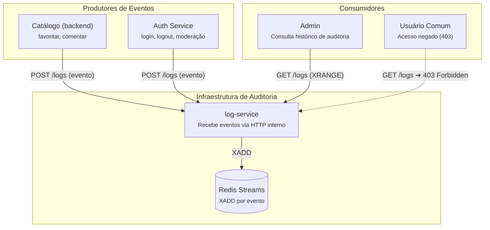

# ISW055 · Atividade 5 · Logs e Auditoria

> **Tema:** Logs e auditoria — quem fez o quê, e quando  
> **Entrega:** Sexta-feira, 25/09/2026  
> **Contexto:** Continuação direta da Atividade 4 (Controle de Acesso / RBAC)

---

## 📌 Contexto & Conceito

Toda ação relevante do sistema — login, favoritar, comentar, moderar — passa a deixar um rastro. O registro não fica gravado em arquivos locais dentro de cada serviço, mas sim em um **microsserviço próprio (`log-service`)**, com o **Redis** armazenando os eventos.

### Log de Auditoria vs. Log de Aplicação
* **Log de Aplicação:** Registra erros, debugs, warnings e stack traces. O objetivo é ajudar a **entender bugs e problemas de infraestrutura**.
* **Log de Auditoria:** Registra comportamento humano (*quem fez o quê, quando e de onde*). O objetivo é garantir **segurança, rastreabilidade e conformidade**, respondendo com precisão "o que aconteceu aqui" caso algo dê errado ou seja excluído.

---

## 🏗️ Arquitetura

### Por que um Microsserviço Próprio e por que Redis?
1. **Separação de Responsabilidades:** Misturar logs de auditoria no banco de dados de negócio (MariaDB) polui o domínio relacional.
2. **Perfil de Carga Diferente:** Logs de auditoria têm padrão *write-heavy* (escreve muito em alto volume, lê raramente e não requer transações relacionais complexas).
3. **Redis Streams (`XADD` / `XRANGE`):** Estrutura de dados otimizada nativamente para append-only ordenado no tempo com alto throughput e suporte a timestamps automáticos.

> **Importante:** Nenhum serviço grava diretamente no Redis. A comunicação é centralizada: os microsserviços enviam eventos via HTTP interno para o `log-service`, que é o único responsável por persistir no Redis.

---

## 📋 Requisitos de Implementação

### 1. Novo Microsserviço: `log-service`
* Container dedicado no `docker-compose.yml`.
* Integrado na mesma rede interna Docker (`app-network`).
* **Isolamento de rede:** Sem porta pública exposta no host (mesmo princípio do `auth-service`).

### 2. Eventos Obrigatórios a Auditar
O sistema deve registrar, no mínimo:
* `login`
* `logout`
* `favoritar_filme`
* `remover_favorito`
* `comentar`
* `apagar_comentario` (moderação / exclusão)
* **`tentativa_negada_403`** (tentativa de ação negada por permissão da Atividade 4 — essencial para auditoria de segurança)

### 3. Estrutura Mínima do Evento
Cada registro de log deve conter:
* `usuario_id` *(int ou null)*
* `acao` *(string descritiva do evento)*
* `timestamp` *(data e hora UTC em ISO 8601)*
* *(Bônus/Opcional)* `ip_origem` *(IP do cliente da requisição)*

### 4. Persistência no Redis
* **Recomendado:** **Redis Streams** utilizando o comando `XADD` para gravação e `XRANGE` para leitura/consulta.
* *(Alternativa):* Lista simples (`LPUSH` / `LRANGE`), com justificativa explícita no `README.md` caso seja utilizada.

### 5. Endpoint de Consulta Exclusivo para Admin
* Rota protegida (ex: `GET /logs?limite=N` ou `GET /api/logs`) que lista os últimos *N* eventos ordenados cronologicamente.
* **Enforcement RBAC:** Protegida pelo controle de acesso da Atividade 4:
  * Usuário `admin` ➔ Consulta autorizada (**200 OK**).
  * Usuário `comum` ➔ Acesso negado com **403 Forbidden**.

### 6. Roteiro de Demonstração Prática
Fluxo para evidenciar a solução:
1. Realizar login com usuário comum.
2. Favoritar um filme.
3. Publicar um comentário.
4. Tentar executar uma ação exclusiva de admin sem ser admin (gerando o evento de recusa 403).
5. Realizar login como administrador.
6. Consultar a rota de logs e demonstrar que todas as ações anteriores foram registradas e estão na ordem cronológica correta.
