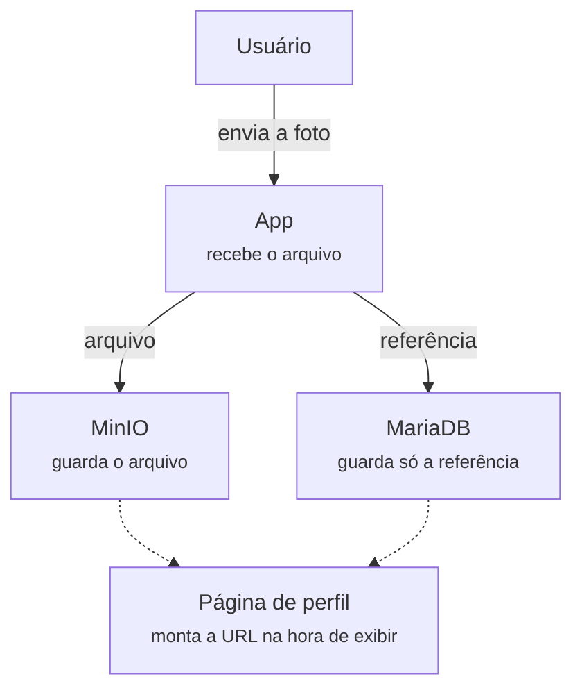

# Upload de foto de perfil

> **Entrega:** sexta-feira, 02/10/2026  
> **continuação direta da atividade 5 (logs e auditoria)**

Até aqui o sistema guarda texto: comentários, favoritos, logs. Agora entra um tipo de dado diferente — arquivo binário, uma imagem de perfil — e ele não vai pro mesmo lugar que o resto.

---

## Conceito

### Por que a imagem não mora no banco

Dá pra guardar um arquivo dentro de uma coluna do MariaDB (tipo BLOB), mas na prática isso é evitado: banco relacional é otimizado pra linhas pequenas e consultas estruturadas, não pra arquivos de alguns megabytes. Cada imagem guardada assim infla o banco, deixa backup mais pesado e mais lento, e não escala bem.

A solução usada por praticamente todo sistema real: o arquivo vai pra um object storage (S3, MinIO, GCS...), e o banco de dados guarda só uma referência — a chave/URL de onde o arquivo está. É exatamente o mesmo MinIO que outras disciplinas desta série já usam pra guardar arquivo — aqui você configura o seu próprio, dedicado a este projeto.

* **Usuário:** envia a foto
* **App:** recebe o arquivo
* **MinIO:** guarda o arquivo (`arquivo`)
* **MariaDB:** guarda só a referência (`referência`)
* **Página de perfil:** monta a URL na hora de exibir

Duas gravações separadas por uma única ação de upload: o arquivo em si vai pro MinIO, e só a chave/URL dele vai pro MariaDB. Exibir o perfil depois é ler a referência e montar a URL — nunca ler o arquivo binário do banco.

---

## Requisitos

### O que implementar

#### 1. Página de perfil
Nome, foto, uma bio curta, e a lista de filmes favoritados do usuário (dado que já existe desde a atividade 2) — a cara de um perfil de rede social simples.

#### 2. Upload de foto de perfil
O arquivo vai pro MinIO (um bucket dedicado a este projeto), a referência (chave do objeto) vai pro MariaDB. Valide tipo de arquivo (só imagem) e um tamanho máximo razoável antes de aceitar o upload.

#### 3. Exibir a imagem de volta
Decida — e documente a decisão no README — entre bucket com leitura pública (mais simples) ou URL pré-assinada/temporária (mais controlada, expira depois de um tempo). Explique o trade-off que você escolheu.

#### 4. Cada um só edita o próprio perfil
Reaproveitando o controle de acesso da atividade 4: um usuário não pode editar o perfil de outro, mesmo enviando o ID de outra pessoa na requisição. O backend confere a identidade de quem está logado, não confia no que veio no corpo da requisição.

---

## Entrega

### Continuar o mesmo repositório
Continue no mesmo repositório público do GitHub das atividades anteriores

* Continue mencionando o professor no README: [github.com/siriani](https://github.com/siriani)
* Mostre o `docker-compose.yml` com o MinIO adicionado
* Print do perfil com a foto de upload aparecendo de verdade
* Demonstre a tentativa (recusada) de editar o perfil de outro usuário