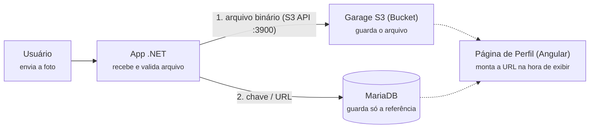

# Catálogo de Filmes — Tom Hanks (Arquitetura de Microsserviços)

> ISW055 · Infraestrutura e Aplicações em Cloud · Professor [@siriani](https://github.com/siriani)  
> Aluno: Gabriel Assis

Aplicação web desenvolvida com arquitetura de microsserviços desacoplados, backend em **.NET 10 (C#) com Domain-Driven Design (DDD)**, frontend em **Angular 19 (SPA)** e banco **MariaDB**.

---

## 🏗️ Arquitetura de Microsserviços

O sistema foi modularizado em microsserviços independentes conectados por uma rede interna de bridge no Docker:

```
                                  REDE EXTERNA (HOST)
                                          │
                                          ▼ Porta 8208
                                ┌───────────────────┐
                                │     frontend      │
                                │ (Angular + Nginx) │
                                └─────────┬─────────┘
                                          │
                  REDE INTERNA DOCKER (app-network) — SEM PORTAS EXTERNAS
                  ───────────────────────────────────────────────────────
                                          │ /api/
                                          ▼
                                ┌───────────────────┐
                                │      backend      │ ───▶ log-service (:8082)
                                │ (Catálogo de      │          │
                                │  Filmes - .NET)   │          ▼
                                └─────────┬─────────┘     Redis Stream (:6379)
                                          │ HTTP Interno   (XADD audit_stream)
                                          ▼ (http://auth-service:8081)
                                ┌───────────────────┐
                                │   auth-service    │ ──▶ Mailtrap (SMTP/API)
                                │  (Autenticação,   │
                                │   Roles & Reset)  │
                                └───────────────────┘
```

### 1. `frontend` (Porta pública: `8208`)
- Interface moderna em **Angular 19** com componentes standalone e lazy-loading.
- Servido via **Nginx** em container alpine.
- Configurado com proxy reverso interno para `/api/` direcionando ao backend.

### 2. `backend` (Catálogo — Porta interna: `8080`)
- ASP.NET Core 10 Web API estruturado em DDD (`Domain`, `Application`, `Infrastructure`, `Api`).
- Responsável pelo catálogo TMDB (proxy seguro), favoritos e comentários.
- **Delega 100% das operações de autenticação** ao `auth-service` via requisições HTTP internas (`http://auth-service:8081`).

### 3. `auth-service` (Autenticação — Porta interna: `8081` — **SEM PORTA NO HOST**)
- Microsserviço dedicado de identidade e autenticação em .NET 10 DDD.
- **Controle de Acesso Baseado em Papéis (*Roles*)**: Suporta papéis como `usuario` e `admin`. A role é injetada nos claims do JWT e exposta via endpoint `/internal/validate`.
- **Recuperação de Senha com Expiração de 30 Minutos**:
  - Geração de token único criptográfico de 32 bytes (UUID hex).
  - Tabela `reset_tokens` com `criado_em`, `expira_em` (30 minutos) e flag `usado`.
  - Validação rigorosa: rejeita tokens inexistentes, expirados ou reutilizados.
- **Envio Real de E-mails via Mailtrap**:
  - Disparo de e-mails transacionais com link de redefinição de senha para ambiente de desenvolvimento/inspeção segura.

### 4. `log-service` (Auditoria — Porta interna: `8082` — **SEM PORTA NO HOST**)
- Microsserviço dedicado de auditoria em .NET 10 Web API.
- Responsável por receber eventos de auditoria emitidos pelo `backend` e `auth-service` e gravá-los no Redis Stream.
- Endpoint de consulta de logs (`GET /logs?limite=N`) protegido por JWT estritamente para o papel `admin`.

### 5. `redis` (Cache & Event Stream — Porta interna: `6379`)
- Servidor Redis 7 em container alpine isolado na rede interna.
- Utiliza **Redis Streams** (`XADD` e `XREVRANGE`) para persistência append-only ordenada no tempo de eventos de auditoria com altíssimo throughput.

---

## 🔒 Comprovação de Isolamento de Rede (Requisito 2)

O serviço `auth-service` **NÃO** expõe portas para a máquina host (`ports:` omitido), comunicando-se exclusivamente pela rede interna `app-network`:

```yaml
version: "3.8"

networks:
  app-network:
    driver: bridge

services:
  frontend:
    build: ./frontend
    ports:
      - "8208:80"        # ÚNICO ponto de entrada público
    depends_on:
      - backend
    networks:
      - app-network

  backend:
    build: ./backend
    expose:
      - "8080"           # Apenas rede interna
    depends_on:
      - auth-service
    env_file: .env
    networks:
      - app-network

  auth-service:
    build: ./auth-service
    expose:
      - "8081"           # ISOLADO: Sem mapeamento 'ports:' no host
    env_file: .env
    networks:
      - app-network
```

---

## 🔄 Fluxo de Recuperação de Senha ("Esqueci Minha Senha")

1. **Solicitação**: O usuário acessa `/auth/forgot-password` e informa o e-mail cadastrado.
2. **Geração**: O `auth-service` gera um token único associado ao usuário com validade estrita de **30 minutos**.
3. **Disparo**: O serviço envia um e-mail com layout escuro responsivo via API do **Mailtrap**, contendo o link de redefinição:  
   `https://gabriel-assis-isw055.lapps.studio/auth/reset-password?token=<TOKEN_UNICO>`
4. **Inspeção no Mailtrap**: O e-mail é capturado na caixa de entrada virtual do Mailtrap para verificação.
5. **Redefinição**: Ao clicar no link, o usuário é direcionado para a tela de redefinição, onde informa a nova senha.
6. **Validação e Invalidação**: O `auth-service` valida o token (existência, tempo de expiração e se já foi utilizado), atualiza o hash BCrypt do usuário e marca o token como `usado = true` para impedir reutilização.

---

## 🛡️ Controle de Acesso Baseado em Papéis (RBAC — Atividade 4)

A autorização no sistema garante o princípio do menor privilégio, controlando o acesso a ações sensíveis estritamente no servidor através de papéis (*roles*).

### 1. Matriz de Permissões por Papel

| Recurso / Funcionalidade | Endpoint | `usuario` | `admin` | Regra de Autorização |
| :--- | :--- | :---: | :---: | :--- |
| **Catálogo de Filmes** | `GET /api/catalog` | ✅ | ✅ | Público / Autenticado |
| **Detalhes do Filme** | `GET /api/catalog/{id}` | ✅ | ✅ | Público / Autenticado |
| **Listar Favoritos** | `GET /api/favorites` | ✅ | ✅ | Apenas os próprios favoritos |
| **Adicionar/Remover Favorito** | `POST`, `DELETE /api/favorites` | ✅ | ✅ | Apenas os próprios favoritos |
| **Visualizar Comentários** | `GET /api/comments/{movieId}` | ✅ | ✅ | Comentários públicos de todos os usuários |
| **Publicar Comentário** | `POST /api/comments` | ✅ | ✅ | Vinculado ao usuário autenticado |
| **Excluir Próprio Comentário** | `DELETE /api/comments/{id}` | ✅ | ✅ | Autor do comentário (`comentario.usuario_id == user.id`) |
| **Moderar Comentário Alheio** | `DELETE /api/comments/{id}` | ❌ **(403)** | ✅ **(200)** | **Ação exclusiva de Admin**: apagar comentário de terceiros |

---

### 2. Ação Exclusiva de Administrador (Moderação) & Enforcement

A ação exclusiva de admin implementada é a **moderação de comentários**:
- Qualquer usuário pode comentar em um filme e ver comentários de outros usuários.
- Um usuário comum (`role: usuario`) tem permissão apenas para excluir os **seus próprios comentários**.
- Se um usuário comum tentar excluir o comentário de outro usuário (mesmo forçando a chamada via Postman, curl ou inspecionar elemento), o servidor rejeita com **`HTTP 403 Forbidden`**:
  ```json
  {
    "erro": "Apenas administradores podem apagar comentários de outros usuários."
  }
  ```
- O administrador (`role: admin`) possui permissão ampla de moderação e pode excluir qualquer comentário.

---

### 3. Resposta Arquitetural: Padrão A ou Padrão B?

> **Qual padrão a aplicação utiliza hoje?**
> A aplicação utiliza o **PADRÃO B (Claims no Token JWT)**.
> 
> **Justificativa e funcionamento atual:**
> No momento do login, o `auth-service` assina criptograficamente a claim `Role` dentro do token JWT (`new Claim(ClaimTypes.Role, usuario.Role)`). Quando o cliente faz requisições ao microsserviço de catálogo (`backend`), este valida a assinatura do token localmente via `JwtBearer` (usando a `JWT_SECRET` compartilhada) e extrai a role da claim, aplicando o enforcement com `403 Forbidden` sem precisar disparar uma chamada de rede para cada ação.
>
> **O que mudaria se fosse para o PADRÃO A (Enforcement Centralizado)?**
> No **Padrão A**, o catálogo não confiaria nas claims internas do token para autorização. A cada ação sensível (`DELETE /api/comments/{id}`), o catálogo faria uma chamada HTTP interna para o `auth-service` (ex: `GET http://auth-service:8081/internal/validate`) repassando o token Bearer para que o `auth-service` consultasse o banco de dados em tempo real.
> - **Trade-off:** O Padrão A permitiria revogação ou alteração imediata de permissão no banco sem esperar o token expirar, porém adicionaria latência de rede (ida e volta) a cada operação e tornaria o `auth-service` um ponto único de gargalo e falha (*single point of failure*). O Padrão B foi adotado pela maior eficiência, escalabilidade e desacoplamento entre microsserviços.

---

### 4. Usuários Pré-configurados para Testes (Seed da Migration)

| Usuário | E-mail | Senha | Papel (`role`) | Finalidade |
| :--- | :--- | :--- | :--- | :--- |
| **Admin** | `admin@catalogo.com` | `admin123` | `admin` | Validação de moderação (sucesso 200) |
| **Usuário 1** | `usuario1@catalogo.com` | `user123` | `usuario` | Autor dos comentários de teste |
| **Usuário 2** | `usuario2@catalogo.com` | `user123` | `usuario` | Tentativa de invasão/moderação alheia (recusa 403) |

---

## 📜 Logs e Auditoria com Redis Streams (Atividade 5)

A auditoria centralizada do sistema registra todas as ações humanas relevantes para rastreabilidade, conformidade e segurança ("quem fez o quê, quando e de onde").

### 1. Log de Auditoria vs. Log de Aplicação
- **Log de Aplicação:** Registra erros, traces e exceções técnicas voltadas a desenvolvedores para depuração de bugs.
- **Log de Auditoria:** Registra ações de negócio executadas por usuários (logins, favoritos, comentários, exclusões e tentativas de acessos negados), persistido em serviço dedicado e imutável.

### 2. Eventos Auditados & Estrutura
Cada evento gravado no stream contém a estrutura:
- `usuario_id`: ID numérico do usuário autenticado (ou nulo em ações anônimas).
- `acao`: Identificador do evento auditado.
- `detalhes`: Contexto complementar da ação (ex: ID do filme ou motivo do bloqueio).
- `ip_origem`: Endereço IP do cliente (capturado dos cabeçalhos `X-Forwarded-For` repassados pelo Nginx).
- `timestamp`: Data/hora UTC no padrão ISO 8601 gerada no momento da ocorrência.

| Evento Auditado | Origem | Descrição |
| :--- | :--- | :--- |
| `login` | `backend` / `auth-service` | Autenticação bem-sucedida de usuário com credenciais válidas. |
| `logout` | `backend` / `frontend` | Encerramento explícito de sessão pelo usuário (`POST /api/auth/logout`). |
| `favoritar_filme` | `backend` (Catálogo) | Inclusão de um filme na lista de favoritos. |
| `remover_favorito` | `backend` (Catálogo) | Remoção de um filme da lista de favoritos. |
| `comentar` | `backend` (Catálogo) | Criação de um novo comentário em um filme. |
| `apagar_comentario`| `backend` (Catálogo) | Exclusão do comentário pelo próprio autor ou moderação por administrador. |
| `tentativa_negada_403` | `backend` | **Evento de Segurança:** Tentativa de violar permissão (excluir comentário alheio ou consultar logs sem ser admin). |

### 3. Por que Redis Streams (`XADD` e `XREVRANGE`)?
- **Desacoplamento e Performance:** Logs têm padrão *write-heavy* (escrita contínua e leitura esporádica). Persistir em banco relacional concorreria com transações de negócio do MariaDB.
- **Estrutura Nativa de Log de Eventos:** O **Redis Streams** foi concebido especificamente para append-only ordenado no tempo:
  - `XADD audit_stream * ...` gera IDs temporais automáticos (milissegundos) com complexidade $O(1)$ de inserção.
  - `XREVRANGE audit_stream + - COUNT N` recupera eficientemente os últimos $N$ eventos em ordem cronológica decrescente.
- **Centralização:** Nenhum serviço grava diretamente no Redis; todos enviam os eventos para o `log-service` via requisições HTTP assíncronas e não-bloqueantes.

### 4. Consulta de Logs & Proteção RBAC
- **Endpoint:** `GET /api/logs?limite=N` (repassado internamente ao `log-service:8082`).
- **Controle de Acesso:**
  - Usuário com `role: admin` ➔ Retorna lista cronológica dos eventos (**200 OK**).
  - Usuário com `role: usuario` ➔ Bloqueado com **`403 Forbidden`** e gera automaticamente o evento `tentativa_negada_403`.

---

## 🚀 Como Executar Localmente

### Pré-requisitos
- .NET 10 SDK
- Node.js 20+ & Angular CLI 19
- Docker e Docker Compose

### Execução via Docker Compose:
```bash
docker compose up --build
```
Acesse a aplicação no navegador em `http://localhost:8208`.

---

## 🐳 Deploy no Portainer

1. Acesse [portainer.lapps.studio](https://portainer.lapps.studio)
2. Atualize a Stack apontando para o repositório no branch `main`.
3. Configure as variáveis no campo **Env**:
   - `TMDB_API_KEY`
   - `MAILTRAP_API_TOKEN`
   - `MAILTRAP_INBOX_ID=4415672`
   - `DB_HOST`, `DB_PORT`, `DB_USER`, `DB_PASSWORD`, `DB_NAME`
   - `JWT_SECRET`
   - `AUTH_SERVICE_URL=http://auth-service:8081`
   - `FRONTEND_URL=https://gabriel-assis-isw055.lapps.studio`
   - `GARAGE_ACCESS_KEY=GK0123456789abcdef01234567`
   - `GARAGE_SECRET_KEY=0123456789abcdef0123456789abcdef0123456789abcdef0123456789abcdef`
   - `GARAGE_BUCKET_NAME=profile-photos`
   - `GARAGE_PUBLIC_BASE_URL=/storage`
4. Clique em **Update the stack**.

---

## 📷 Atividade 6 — Upload de Foto de Perfil (Object Storage com Garage S3)

> **Entrega:** Sexta-feira, 02/10/2026  
> **Professor:** [@siriani](https://github.com/siriani)  
> **Continuação direta da Atividade 5 (Logs e Auditoria)**

Nesta atividade, o sistema passou a suportar dados binários (imagens de perfil de usuários), separando o armazenamento do arquivo do banco relacional de negócio.

### 1. Por que a imagem não mora no banco?
Bancos relacionais (MariaDB/MySQL) são projetados e indexados para linhas pequenas e consultas estruturadas. Armazenar arquivos em colunas `BLOB` infla desnecessariamente o banco, degrada rotinas de backup, reduz o throughput do pool de conexões e consome memória cache valiosa do SGBD.

A arquitetura adotada separa as responsabilidades em duas gravações complementares por ação de upload:
1. **O arquivo binário** vai diretamente para o **Object Storage (Garage S3)** via API S3 padrão AWS.
2. **Apenas a referência (chave e URL)** é persistida na coluna `foto_chave` e `foto_url` da tabela `usuarios` no **MariaDB**.



---

### 2. Escolha Tecnológica: Garage S3 (GarageHQ)
Conforme levantado no estudo de arquitetura, a infraestrutura adota o **Garage S3** (`dxflrs/garage:v1.0.1`), um object storage distribuído moderno, ultraleve e desenvolvido em **Rust**:
* **Alta Eficiência e Baixo Footprint:** Consome apenas ~30 MB a 50 MB de RAM (comparado aos ~250 MB do MinIO).
* **API S3 Padrão da AWS:** Totalmente compatível com o `AWSSDK.S3` utilizado pelo backend .NET.
* **Resiliência e Disponibilidade:** Disponível de forma pública e estável no Docker Hub.

---

### 3. Trade-off Escolhido para Exibição da Imagem (Requisito 3)

O enunciado solicita a decisão e justificativa documentada entre **Bucket com Leitura Pública** ou **URL Pré-assinada (Presigned URL)**:

| Critério | **Bucket com Leitura Pública via Nginx Proxy** *(Opção Escolhida)* | **URL Pré-assinada / Temporária** |
| :--- | :--- | :--- |
| **Complexidade** | **Baixa**: URL persistida estática e montada diretamente na tag `` | **Alta**: Backend precisa gerar token criptográfico assinado a cada requisição de perfil |
| **Cache HTTP** | **Excelente**: Navegadores e proxies realizam cache transparente via headers ETag/Last-Modified | **Inexistente/Ruim**: Cada assinatura altera a querystring da URL, quebrando o cache de CDN e browser |
| **Segurança** | Adequada: Apenas o bucket de fotos públicas de perfil possui política de leitura aberta | Alta: Arquivo só acessível durante a janela de expiração configurada |

#### Justificativa da Decisão:
Adotamos o **Bucket com Leitura Pública (Public Read)** servido através do proxy reverso do Nginx (`/storage/`).
- Em uma aplicação social de catálogo de filmes, **fotos de perfil são recursos essencialmente públicos**.
- O uso de URLs públicas estáticas permite **cache HTTP local e de borda**, diminuindo latência e consumo de banda do servidor.
- O storage permanece **100% isolado na rede interna Docker** (`app-network`). O acesso público ocorre apenas através do Nginx na mesma porta `8208` direcionando para o endpoint web do Garage com o Host header apropriado.

---

### 4. Proteção Estrita contra IDOR (Requisito 4)

O sistema reaproveita o controle de acesso por JWT. Um usuário logado **jamais** consegue alterar a bio ou a foto de outro usuário:
- Os endpoints `PUT /api/profile` e `POST /api/profile/photo` extraem o identificador do usuário **exclusivamente dos claims criptográficos do token JWT** validado (`User.FindFirst("userId")`).
- Caso um cliente malicioso envie no corpo da requisição um `TargetUserId` pertencente a outro usuário (simulação de ataque IDOR), o backend:
  1. Detecta a divergência entre a identidade autenticada e o alvo.
  2. Rejeita imediatamente a operação com **`HTTP 403 Forbidden`**.
  3. Emite um evento de segurança no `log-service` (`tentativa_idor_bloqueada`) com IP de origem e IDs envolvidos.

---

### 5. Fragmento do `docker-compose.yml` com Garage S3

```yaml
  garage:
    image: dxflrs/garage:v1.0.1
    environment:
      - GARAGE_ACCESS_KEY=${GARAGE_ACCESS_KEY:-GK0123456789abcdef01234567}
      - GARAGE_SECRET_KEY=${GARAGE_SECRET_KEY:-0123456789abcdef0123456789abcdef0123456789abcdef0123456789abcdef}
      - GARAGE_BUCKET_NAME=${GARAGE_BUCKET_NAME:-profile-photos}
    volumes:
      - ./garage/garage.toml:/etc/garage.toml:ro
      - ./garage/init.sh:/init.sh:ro
      - garage_meta:/var/lib/garage/meta
      - garage_data:/var/lib/garage/data
    entrypoint: ["/bin/sh", "/init.sh"]
    expose:
      - "3900"           # API S3 na rede interna Docker
      - "3902"           # Web S3 (acesso público) na rede interna Docker
    networks:
      - app-network
    restart: unless-stopped

volumes:
  garage_meta:
  garage_data:
```

