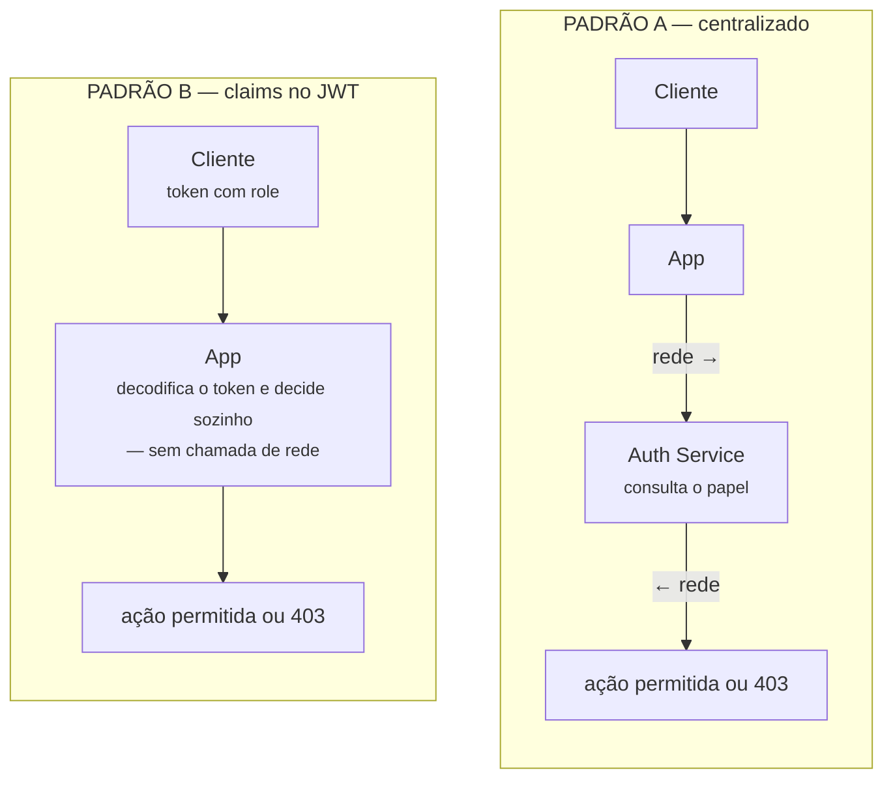

# ISW055 · Atividade 4 · Autorização

## Controle de acesso por papel — RBAC de verdade

O campo `role` que você criou na atividade 3 existia, mas não fazia nada. Hoje ele passa a decidir, de verdade, o que cada usuário pode ou não fazer — e o servidor, nunca o cliente, é quem decide isso.

Autenticação responde "quem é você" — foi o assunto da atividade 3. Autorização responde "o que você pode fazer", e é o assunto de hoje. São duas perguntas diferentes, e um erro comum é resolver só a primeira e achar que resolveu as duas.

O erro clássico de iniciante: esconder um botão de admin na tela achando que isso é segurança. Não é — é só interface. Qualquer pessoa com um pouco de curiosidade abre as ferramentas de desenvolvedor do navegador, ou chama o endpoint direto pelo Postman, e o botão escondido não impede nada. A validação real da permissão precisa acontecer no servidor, sempre — é isso que esta atividade cobra.

---

## Conceito

### O que é RBAC

**Role-Based Access Control**: permissões são atribuídas a papéis, não a pessoas. O usuário recebe um papel; o papel carrega um conjunto de permissões. Mudar o que um admin pode fazer é uma mudança num lugar só — não em cada usuário admin, um por um.

```mermaid
flowchart LR
    subgraph Componentes
        U[USUÁRIO<br><small>A pessoa autenticada.<br><em>já existe (atividade 3)</em></small>]
        P[PAPEL (ROLE)<br><small><code>usuario</code>, <code>admin</code><br><em>já existe, mas não fazia nada</em></small>]
        PE[PERMISSÃO<br><small>Uma ação sobre um recurso — ex:<br><code>apagar:comentário-de-outro</code><br><strong>é o que falta – hoje</strong></small>]
        A[ATRIBUIÇÃO<br><small>O vínculo usuário ↔ papel.<br><em>já existe (campo role no cadastro)</em></small>]
    end

    Usuario[Usuário] -->|tem| Papel[Papel]
    Papel -->|concede| Permissao[Permissão]
    Permissao -->|sobre| Recurso[Recurso]
```

> **As quatro peças do RBAC:** Você já tem Usuário, Papel e Atribuição desde a atividade 3 — Permissão é a peça que falta, e é o que esta atividade constrói.

Contraste rápido, só pra contexto (não precisa implementar):
* **ACL (Access Control List):** decide permissão por pessoa individual — não escala, muda usuário por usuário.
* **ABAC (Attribute-Based):** decide por atributos dinâmicos — dono do recurso, hora do dia — mais flexível que RBAC, mas mais complexo.
* **RBAC:** é o meio-termo que a maioria dos sistemas reais usa.

---

## Arquitetura

### Onde a verificação de permissão acontece

O `auth-service` da atividade 3 já representa um padrão específico. Vale nomear qual, e comparar com o principal alternativo — a escolha que você já fez não é "a única forma".

#### PADRÃO A — enforcement centralizado
É o que você já tem. Toda ação sensível faz uma chamada de rede pro `auth-service` perguntando *"esse usuário pode fazer isso?"*.
* **A favor:** mudar uma regra de permissão é mudar um lugar só, efeito imediato pra todo mundo.
* **Contra:** toda ação depende de uma ida-e-volta de rede a mais; o `auth-service` vira ponto único de gargalo/falha.

#### PADRÃO B — claims no token (JWT)
Alternativa, não precisa implementar. O papel do usuário já vem dentro do próprio token de login, assinado — cada serviço decide sozinho, sem chamada extra.
* **A favor:** mais rápido, menos acoplado a um serviço externo.
* **Contra:** se o papel de alguém mudar, só tem efeito quando o token expirar e for renovado — não é imediato.



> No **Padrão A**, decidir uma permissão custa uma ida-e-volta de rede até um serviço externo. No **Padrão B**, essa seta desaparece porque a informação do papel já veio dentro do token — a troca é velocidade por atraso na revogação (o papel só atualiza quando o token expira).

---

## Requisitos

### O que implementar

#### 1. Permissões documentadas por papel
Escreva, no `README`, uma lista clara do que `usuario` pode fazer e do que `admin` pode fazer além disso. Não deixe implícito no código — documente antes de implementar.

#### 2. Uma ação exclusiva de admin, de verdade
* **Sugestão principal:** apagar comentário de qualquer usuário (moderação) — um `usuario` comum só pode apagar o próprio.
* **Alternativa:** um endpoint que lista todos os usuários e permite promover/rebaixar o papel de alguém.

#### 3. Enforcement no backend
O `auth-service` (ou o catálogo, consultando o `auth-service`) precisa recusar a ação com `403` quando um `usuario` comum tentar a ação de admin — mesmo chamando o endpoint direto pelo Postman/curl, sem passar pela interface.

#### 4. Demonstração prática
Dois logins — um `usuario`, um `admin` — tentando a mesma ação exclusiva. O comum recebe `403`; o admin executa com sucesso. Print dos dois casos.

#### 5. Resposta curta: Padrão A ou B?
No `README`, responda: qual dos dois padrões da seção de arquitetura o seu `auth-service` usa hoje? E o que mudaria no seu código se fosse pro outro padrão? Não precisa implementar — só justificar em poucas linhas.